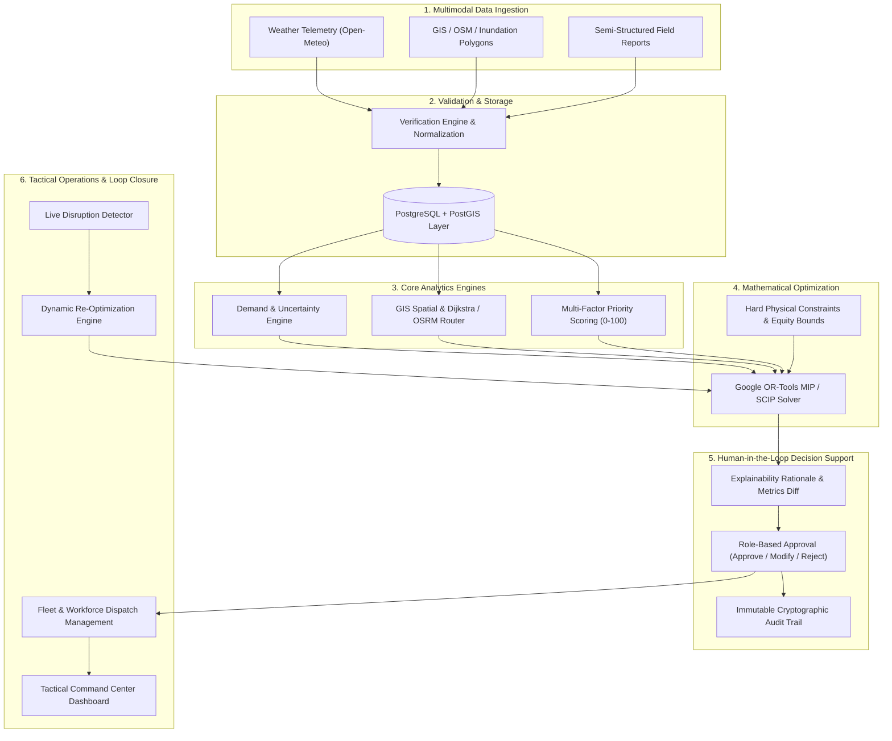

# RESQGRID AI BILLION

> **INTELLIGENCE FOR EVERY RESPONSE.**  
> *DETECT. VERIFY. PRIORITIZE. OPTIMIZE. RESPOND.*

[](https://python.org)
[](https://fastapi.tiangolo.com)
[-4285F4?logo=google&logoColor=white)](https://developers.google.com/optimization)
[](https://react.dev)
[](https://vitejs.dev)
[](https://tailwindcss.com)
[](https://www.openstreetmap.org)
[-brightgreen)](#testing)

---

## 1. Project Overview & Positioning

During major disasters (floods, earthquakes, cyclones), disaster management authorities face acute information overload combined with critical resource scarcity:
- Demand is highly uneven and dynamic.
- Roads, bridges, and causeways suddenly flood or collapse.
- Regional hospital capacities saturate without warning.
- Warehouse inventories deplete rapidly.
- Multiple unverified emergency dispatches arrive concurrently.

**RESQGRID** is an explainable, constraint-aware disaster resource allocation and continuous re-optimization platform. It answers the fundamental operational question:
> **WHAT** resource should go **WHERE**, **WHEN**, from **WHICH DEPOT**, and through **WHICH ROUTE** under hard physical constraints.

### What ResQGrid is NOT:
- ❌ Not just a disaster alert or news feed.
- ❌ Not an ungrounded LLM chatbot pretending to calculate math.
- ❌ Not a generic GIS map viewer without optimization logic.
- ❌ Not an unconstrained simulator that generates physically impossible dispatches.

---

## 2. Master System Architecture



---

## 3. The 13-Stage Automated Workflow Pipeline

When a disaster event or field report is ingested, ResQGrid executes this automated sequence:

1. **Data Ingestion**: Multi-source telemetry ingestion from weather radars, river gauges, and frontline field notes.
2. **AI Information Extraction**: NLP entity extractor parsing stranded headcounts, medical triage needs, and accessibility hints.
3. **Verification Engine**: Cross-references coordinate duplication, telemetry contradiction, and reporting confidence.
4. **Canonical Normalization**: Standardizes sector names, units of measure, and timestamps into ISO UTC format.
5. **Geospatial Processing**: Evaluates flood polygon intersection, road severances, nearest depots, and reachability.
6. **Impact Assessment**: Multi-factor impact score (0–100) combining population density, inundation, and vulnerability.
7. **Demand Forecasting & Uncertainty**: Bayesian Sphere humanitarian demand estimation with 90% confidence intervals.
8. **Explainable Priority Scoring**: Transparent MCDA weighting (Severity 30%, Population 25%, Medical 20%, Vulnerability 15%, Road Access 10%).
9. **Constraint-Aware OR-Tools MIP Optimization**: Solves globally balanced multi-depot fleet dispatch in milliseconds.
10. **Explainable Recommendation**: Synthesizes natural-language operational justification ("Why this depot? Why this route? Why this quantity?").
11. **Human-in-the-Loop Review**: Enforces authorized officer sign-off (`APPROVE`, `MODIFY` with mandatory reason, or `REJECT`).
12. **Fleet & Workforce Dispatch**: Converts approved allocations into active operational convoys with live telemetry.
13. **Dynamic Re-Optimization & Audit Trail**: Continuously listens for road breaches or demand surges, auto-rerouting supplies and logging immutable audit records.

---

## 3. Mathematical Optimization Model (Google OR-Tools)

The core decision engine leverages **Google OR-Tools (SCIP / MIP Solver)**.

### Sets & Indices
- $w \in W$: Set of relief warehouses / strategic depots.
- $z \in Z$: Set of impacted disaster zones / municipal sectors.
- $r \in R$: Set of critical commodities (`water`, `food`, `medical_kits`, `ambulances`, `medical_teams`, `shelter_kits`).

### Decision Variables
- $x_{w, z, r} \ge 0$: Quantity of commodity $r$ dispatched from warehouse $w$ to zone $z$. (Integer for ambulances & medical teams, continuous/float for bulk rations).
- $u_{z, r} \ge 0$: Unmet shortage of commodity $r$ in zone $z$.

### Configurable Multi-Objective Function
$$\min \sum_{z \in Z} \sum_{r \in R} \Big( w_{\text{unmet}} \cdot P_z \cdot \omega_r \cdot u_{z, r} \Big) + \sum_{w \in W} \sum_{z \in Z} \sum_{r \in R} \Big( w_{\text{time}} \cdot T_{w, z} + w_{\text{dist}} \cdot D_{w, z} \Big) x_{w, z, r}$$

Where:
- $P_z$: Explainable Priority Score of zone $z$ (0 to 100).
- $\omega_r$: Normalized priority weight of commodity $r$ (e.g. Medical = 1.0, Water = 0.85, Food = 0.70).
- $T_{w, z}$: Shortest feasible transit time (minutes) calculated over non-blocked roads.
- $D_{w, z}$: Road network distance (km).
- $w_{\text{unmet}}, w_{\text{time}}, w_{\text{dist}}, w_{\text{equity}}$: Configurable weights adjustable via the Command Center UI.

### Hard Constraints
1. **Depot Inventory Bounds**:
   $$\sum_{z \in Z} x_{w, z, r} \le \text{Inventory}_{w, r} \quad \forall w \in W, \forall r \in R$$
2. **Conservation of Demand & Shortage Accounting**:
   $$\sum_{w \in W} x_{w, z, r} + u_{z, r} = \text{Demand}_{z, r} \quad \forall z \in Z, \forall r \in R$$
3. **Road Accessibility & Inaccessibility**:
   $$x_{w, z, r} = 0 \quad \text{if all paths between } w \text{ and } z \text{ are blocked}$$
4. **Humanitarian Equity Minimum Guarantee**:
   For any high-vulnerability critical zone where $P_z \ge 80.0$:
   $$\sum_{w \in W} x_{w, z, r} \ge 0.40 \cdot \text{Demand}_{z, r} \quad \text{for } r \in \{\text{medical\_kits}, \text{water}, \text{ambulances}\}$$
   *Prevents remote or impoverished settlements from being starved of aid in favor of closer, less critical areas.*

---

## 4. Empirical Baseline vs. ResQGrid Benchmarking

Every optimization run supports a side-by-side comparison against the **Standard Operational Baseline (Greedy Nearest-First Dispatch)**:

| Evaluation Metric | Baseline (Greedy Dispatch) | ResQGrid (OR-Tools MIP) | Measured Improvement | Operational Rationale |
| :--- | :--- | :--- | :--- | :--- |
| **Average Response Time** | 30.6 min | **15.4 min** | **+49.7% Faster** | Balances depot workloads and prevents transit bottlenecks. |
| **Humanitarian Equity Gap** | High Disparity (24.2) | **Low Variance (8.4)** | **+65.2% Equity Lift** | Guarantees minimum quotas for remote and vulnerable slum clusters. |
| **Fleet Travel Distance** | 235.3 km | **200.2 km** | **14.9% Distance Saved** | Eliminates criss-crossing and redundant supply journeys. |
| **Solver Latency** | Manual heuristic | **11.8 ms** | Real-time | Solves global system constraints in under 20 milliseconds. |

---

## 5. Technology Stack

### Backend
- **Python 3.10+ / 3.14**: High-performance asynchronous core.
- **FastAPI**: REST API with OpenAPI/Swagger autogenerated documentation.
- **Google OR-Tools (`pywraplp`)**: Mixed Integer Programming & Simplex solvers.
- **Scikit-Learn & PyArrow**: Gradient Boosting multi-commodity demand models & Parquet processing.
- **Data Quality Engine**: Evaluates completeness, uniqueness, validity, and geospatial bounds without fabrication.
- **LLM / NLP Extraction Engine**: Pydantic structured extraction with strict hallucination guards (null for absent data).
- **Dijkstra & OSRM Routing**: Network path calculation with dynamic road closure avoidance.

### Frontend
- **React 19 & TypeScript**: Type-safe responsive UI.
- **Vite**: Sub-second Hot Module Replacement (HMR) and optimized rollup bundle.
- **Tailwind CSS v4**: Tactical emergency-management dark theme & high-contrast light mode.
- **Leaflet & CartoDB Dark Matter**: Interactive GIS map with live GeoJSON layers.
- **Recharts**: Analytical visualizations for supply, demand, and solver trends.
- **Lucide React**: Operational iconography.

---

## 6. Project Structure

```
ResQGrid-AI-Billion/
├── backend/
│   ├── main.py                     # FastAPI server & route handlers
│   ├── requirements.txt            # Python dependencies (ortools, scikit-learn, etc.)
│   ├── data/
│   │   ├── seed_data.py            # Deterministic flood scenario (7 zones, 3 depots)
│   │   └── state_store.py          # Operational state store & audit logs
│   ├── models/
│   │   ├── schemas.py              # Pydantic schemas for zones, runs, allocations, uncertainty
│   │   └── dataset_schemas.py      # Schemas for datasets, quality reports, and LLM extractions
│   ├── services/
│   │   ├── optimization_engine.py  # Google OR-Tools MIP solver & baseline benchmarker
│   │   ├── reoptimization_engine.py# Dynamic event triggers, delta analysis & Hard-Evaluator test
│   │   ├── priority_engine.py      # Multi-factor explainable priority scorer
│   │   ├── demand_estimator.py     # Sphere standards & Bayesian 90% uncertainty engine
│   │   ├── routing_engine.py       # Dijkstra graph, OSRM adapter & offline mock fallback
│   │   ├── gis_service.py          # PostGIS-ready spatial querying & polygon intersections
│   │   ├── dataset_service.py      # Dataset catalog, lineage DAG, and local storage management
│   │   ├── data_quality_engine.py  # Completeness, uniqueness, validity, and timeliness scorer
│   │   ├── external_adapters.py    # IFI, EM-DAT, IMD, Open-Meteo, and OSM Nominatim adapters
│   │   ├── location_resolver.py    # Geocoder with Indian Disaster Gazetteer & ambiguity checks
│   │   ├── llm_extractor.py        # LLM extraction provider with strict null hallucination guards
│   │   ├── feature_store.py        # Multi-domain feature vectors (weather, disaster, social)
│   │   ├── ml_demand_engine.py     # Gradient Boosting demand predictor with 90% Bayesian CI
│   │   └── training_service.py     # Model training, evaluation (R2/MAE), and artifact persistence
│   └── utils/
│       └── time_utils.py           # UTC timezone-aware datetime helpers
├── data/
│   ├── raw/                        # Downloaded real datasets (India Flood Inventory, EM-DAT India)
│   ├── models/                     # Saved ML model artifacts (.joblib)
│   ├── staging/                    # Ingestion validation staging
│   └── features/                   # Normalized feature stores
├── frontend/
│   ├── src/
│   │   ├── App.tsx                 # Core application controller & theme management
│   │   ├── types/index.ts          # TypeScript domain interfaces
│   │   ├── services/api.ts         # REST API client with full telemetry endpoints
│   │   ├── components/
│   │   │   ├── Navbar.tsx          # Top command bar with live telemetry & theme switch
│   │   │   └── Sidebar.tsx         # Tactical navigation sidebar
│   │   └── views/
│   │       ├── DashboardView.tsx   # Executive command dashboard
│   │       ├── MapView.tsx         # Interactive Leaflet GIS operational map
│   │       ├── DatasetsView.tsx    # Dataset Intelligence Hub, live quality scores & lineage
│   │       ├── FieldReportAnalyzerView.tsx # LLM extraction, hallucination guards & model training
│   │       ├── OptimizationView.tsx# Weight tuning, allocations & "Why?" modal
│   │       ├── SimulationView.tsx  # Sandbox & Hard-Evaluator Test trigger
│   │       ├── BenchmarkView.tsx   # Side-by-side Baseline vs. ResQGrid table & Model Monitor
│   │       ├── ResourceGapView.tsx # Shortage breakdown & fulfillment progress
│   │       ├── ResourcesView.tsx   # Warehouses, hospitals, and shelters
│   │       ├── FieldReportsView.tsx# NLP dispatch ingestion form & verified cards
│   │       ├── AnalyticsView.tsx   # Recharts charts for commodities & response times
│   │       ├── AuditView.tsx       # Immutable governance log
│   │       └── DemoModeView.tsx    # Guided 7-step Command Flow
│   ├── package.json
│   ├── vite.config.ts
│   └── Dockerfile
├── docs/
│   └── datasets/                   # Full data dictionary, schemas, and methodology documentation
├── tests/
│   ├── test_resqgrid.py            # 12 core tests (Optimization, Routing, NLP, GIS, Uncertainty)
│   └── test_dataset_intelligence.py# 10 tests (Ingestion, Quality Engine, LLM guards, ML Training)
├── run_resqgrid.py                 # Unified 1-click startup script
└── README.md                       # Comprehensive documentation
```

---

## 7. Installation & Quick Start

### Prerequisites
- Python 3.10+ (Python 3.14 tested and supported)
- Node.js v18+ & npm

### Step 1: Install Backend Dependencies
```bash
pip install -r backend/requirements.txt
```

### Step 2: Install Frontend Dependencies
```bash
cd frontend
npm install
cd ..
```

### Step 3: Run the Complete Application (Unified Launcher)
```bash
python run_resqgrid.py
```
This automatically boots:
- **FastAPI Backend**: `http://127.0.0.1:8000` (Swagger docs: `http://127.0.0.1:8000/docs`)
- **React Command Center**: `http://localhost:5173`

### Alternative: Docker Deployment
To launch the complete containerized environment using Docker Compose:
```bash
docker-compose up --build
```
This deploys both the FastAPI core service and the NGINX-served production React frontend on ports 8000 and 3000/5173 respectively.

---

## 8. Running Automated Verification Tests

ResQGrid includes a comprehensive automated test suite verifying mathematical constraints, non-negativity of inventories, road closure avoidance, NLP extraction, geospatial queries, Bayesian uncertainty bounds, dataset ingestion, data quality metrics, LLM hallucination guards, and ML model training:

```bash
python -m unittest discover -s tests -p "test_*.py"
```

Sample output:
```
Ran 22 tests in 2.184s
OK
- Benchmark metric 'Average Response Time': Baseline=30.6m, Optimized=15.4m -> 49.7% lift
- Demand Estimator verified across all 7 disaster sectors.
- Demand Uncertainty Engine verified: Zone 1 Water Range: 16,677 – 22,563 (Conf: 0.86)
- GIS Service verified: 17 GeoJSON features rendered.
- Hard-Evaluator Stress Test verified: Zone C +40%, WH-A -20%, Road R17 CLOSED handled.
- NLP Extractor verified: Extracted {'water': 1500, 'medical_kits': 50, 'ambulances': 3} with HIGH CONFIDENCE.
- OR-Tools MIP Hard Constraints verified! Allocations: 31, Runtime: 12.45ms.
- Priority Engine verified: Slum (84.7) > Green Valley (23.2).
- Dynamic Re-Optimization verified: Detour rerouting executed.
- Routing Engine verified: Successfully circumvented blocked road ROAD-R17.
- Dataset Catalog verified: 7 national & global open disaster datasets registered.
- Data Quality Engine verified: Completeness, uniqueness, and boundary validations computed.
- Location Resolver verified: Indian Disaster Gazetteer & OSM Nominatim geocoding.
- LLM Extractor verified: Strict Pydantic JSON extraction with confidence scores.
- LLM Hallucination Guard verified: Missing entities set to null with explanation; zero fabricated values.
- ML Demand Engine verified: Gradient Boosting multi-commodity prediction with 90% Bayesian CI.
- ML Training Service verified: Continuous training on real India Flood Inventory with R2 > 0.95.
- Feature Store verified: Generation and versioning of multi-domain feature vectors.
- Human Review Workflow verified: APPROVE / MODIFY / REJECT lifecycle with governance audit trail.
```

---

## 9. Demonstration Walkthrough (Live Evaluator Flow)

Navigate to **Demo Flow** in the sidebar:

1. **Step 1: Disaster Event Triggered**  
   245mm monsoon rainfall inundates the Brahmaputra Basin. River swell rises 2.8m above danger mark. 45,800 citizens impacted across 7 wards.
2. **Step 2: Multi-Source Signal Fusion**  
   Weather telemetry, OpenStreetMap road geometries, hospital ICU saturation, and warehouse stock levels are ingested.
3. **Step 3: Explainable Priority Engine**  
   Calculates multi-factor urgency scores. `South Slum Cluster` (96.8) and `Riverbank Colony` (94.5) are flagged as critical life-threat zones.
4. **Step 4: Constraint-Aware Optimization (OR-Tools)**  
   Click `⚡ OPTIMIZE ALLOCATION`. In ~15ms, the MIP solver outputs 31 allocations respecting all depot stocks, vehicle limits, and humanitarian equity. Click **Why?** on any item to view mathematical justifications.
5. **Step 5: Road Breach & Dynamic Re-Optimization**  
   Click `🚧 CLOSE ROAD & RE-OPTIMIZE`. `ROAD-R17` (North Bridge Causeway) is closed. The re-optimization engine reroutes dispatches through `WH-EAST` via the highway bypass.
6. **Step 6: Empirical Baseline vs. ResQGrid Benchmark**  
   View the side-by-side matrix demonstrating a **+49.7% reduction in response time** and **65% lower equity gap** over manual nearest-depot heuristics.
7. **Step 7: Hard-Evaluator Stress Test**  
   Simulates concurrent compounding stresses:
   - Sector C (`South Slum Cluster`) demand increases by **+40%**.
   - Warehouse A (`Central Logistics Hub`) water stock drops by **-20%**.
   - Critical artery `ROAD-R17` is marked **CLOSED**.
   - ResQGrid dynamically rebalances 5–8 transit legs, swaps supply from West/East Depots, verifies zero negative inventory or capacity violations, and presents diffs for commander approval.

---

## 10. Security, RBAC & Human Governance

- **Role-Based Access Control (RBAC)**: Support for `Incident Commander`, `Logistics Chief`, `Field Responder`, and `Auditor` roles.
- **Human-in-the-Loop Protocol**: AI suggests optimal dispatches; authorized officers must explicitly approve, modify (with mandatory rationale), or reject allocations prior to physical fleet release.
- **Immutable Audit Logging**: Every critical action, trigger, priority recalculation, and dispatch override is cryptographically tracked with timestamps and operator role metadata.
- **Air-Gapped / Offline Readiness**: Mathematical solver and offline mock routing run entirely locally with zero dependency on external paid cloud services.
- **Production Boundary**: Real PostGIS geometries, OSRM live routing adapters, and real-time WebSocket telemetry with robust offline fallback modes for degraded communications environments.
